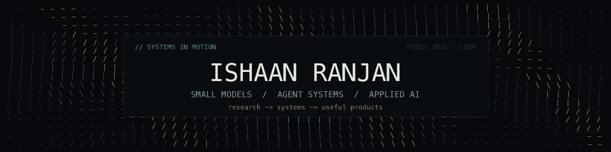

  

  I build practical AI systems across research, developer tools, and products.
   
  Currently: Luxen AI · Georgia Tech CyFI · Incoming Georgia Tech CS

  <a href="https://ishaanranjan.com">Website</a>
  &nbsp;·&nbsp;
  <a href="https://www.linkedin.com/in/ishaan-ranjan-86a41a217">LinkedIn</a>
  &nbsp;·&nbsp;
  <a href="mailto:ishaanranjan15@gmail.com">Email</a>

## Selected work

<table>
  <tr>
    <td width="50%" valign="top">
      <h3><a href="https://github.com/IshaanAyaan/slm-agents">Small-model agent research</a></h3>
      
A controlled 200-task study reached 94.5% success with a fine-tuned 3B specialist versus 95.5% for a 72B baseline, at 84.8% lower cost per successful task.

      <a href="https://github.com/IshaanAyaan/slm-agents">Study and frozen results</a> · <a href="https://github.com/LuxenAI/regimen">Later Regimen integration work</a>
    </td>
    <td width="50%" valign="top">
      <h3><a href="https://github.com/IshaanAyaan/YConstruction">YConstruction</a></h3>
      
A voice-first iPhone app that turns on-device transcription and photos into IFC-grounded construction defects, then syncs BCF issues for architect review.

      Selected for a live pitch to YC investors at the YC × Google DeepMind hackathon · SwiftUI
    </td>
  </tr>
  <tr>
    <td width="50%" valign="top">
      <h3><a href="https://github.com/LuxenAI/arbor">Arbor</a></h3>
      
A local-first desktop workspace for managing master and subagent sessions, shared context, runtime switching, and human review without requiring a hosted backend.

      Electron · TypeScript · Multi-agent systems
    </td>
    <td width="50%" valign="top">
      <h3><a href="https://github.com/IshaanAyaan/prism-policy-dashboard">PRISM</a></h3>
      
A research system for policy classification, causal audit, and crash-risk forecasting across a 51-state alcohol-policy panel.

      <a href="https://prism-policy-dashboard.vercel.app">Interactive dashboard</a> · Preprint · Causal inference
    </td>
  </tr>
</table>

## Current and recent experience

- **Luxen AI — Co-Founder & Engineering Lead** · Dec 2023–present. Building applied-AI products and developer tools from user discovery through architecture, evaluation, and deployment.

- **Georgia Tech CyFI — Undergraduate Researcher** · Jun 2026–present. Reproduced the supported NVIDIA Nemotron Elastic 12B parent and 9B/6B subnetworks on an A100, documenting configurations, width slicing, and current evaluation limits.

- **University of Arizona Precision Aging Network — Research Intern** · Summer 2025. Analyzed biological-aging measures in R and Python, reporting null findings and confounding constraints rather than forcing a preferred result.

## More work

[Debatica](https://github.com/IshaanAyaan/debaticav2) ·
[SchoolPulse AI](https://github.com/IshaanAyaan/SchoolPulse-AI) ·
[A.C.R.E.](https://github.com/IshaanAyaan/GreenhouseAgent) ·
S.A.B.E.R.

  Incoming Georgia Tech CS · Peoria, Arizona

